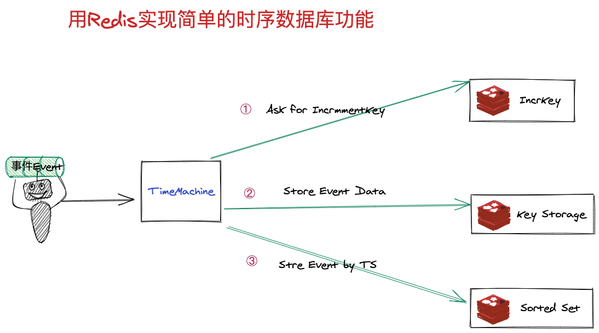

# [TimeMachine]一款依赖Redis完成事件续统计的SDK


## 存储逻辑简介


## 现支持的一些API
```go
	PutEvent(ctx context.Context, event *model.Event) error
	ListEventsByTime(ctx context.Context, start, end int64) ([]*model.Event, error)
	CountEventsByTime(ctx context.Context, start, end int64) (int64, error)
	ListTypeEventsByTime(ctx context.Context, eventType string, start, end int64) ([]*model.Event, error)
	CountTypeEventsByTime(ctx context.Context, eventType string, start, end int64) (int64, error)
```

### quick start
```go
func TestMachine_Put(t *testing.T) {
	machine := NewTimeMachine(&TimeMachineConf{
		RedisConf: &dao.ConnectionConf{RedisAddress: "127.0.0.1:6379"},
		TTL:       time.Hour,
	})
	err := machine.Put(ctx, &model.Event{
		Metadata:  []byte("testDemo1"),
		Timestamp: time.Now(),
	})
	_ = assert.Nil(t, err, nil)
}
```